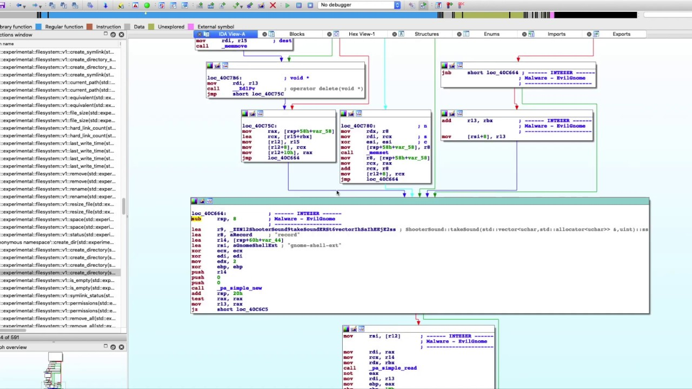

# Game Hacking with Rust

---

## Target Audience

- You should know how to program
- Systems Programming basics

---

## You need to download:

- [AssaultCube](https://assault.cubers.net/download.html)
- [Rust](https://rustup.rs/)
- [VSCode](https://code.visualstudio.com/download) with Rust Analyzer extension

<!-- 
- [IDA Free](https://hex-rays.com/ida-free/)
- [Cheat Engine](https://www.cheatengine.org/) (Windows)
- [Scanmem](https://github.com/scanmem/scanmem) (Linux)
 -->

---

## Source Code

Available here: 
https://github.com/not-matthias/game-hacking-workshop
or
https://shorturl.at/jmqrV

---

## About Rust

- Types: `i16` vs `u16`
- Functions: `fn foo(bar: u32) -> i16 {}`
- Variables: `let mut temp = 42;`
- Run with: `cargo r` or `cargo run`

---

## Important Concepts

---

### What is a pointer?

- Points to a memory location
- 64 Bit Process => 64 Bit pointers
- 32 Bit Process => 32 Bit pointers

---

### External vs Internal Cheats

TODO

---

## Useful tools

---

### Cheat Engine

---

### Reclass

---

### IDA

---

### x64Dbg

---

## Let's get started

<!-- 

- Show how you can find the offset in IDA
- Show how you can find it with findmem
- Write to health (static)
- Read player, write to health offset

-->

---

## What we learned

---

## And this is just the start...

---

### More ideas

- Read enemy positions -> Radar or ESP
- Aimbot
- Movement Speed multiplier
- No Recoil / Spread

---

## Anticheats

- EasyAntiCheat
- Battleye
- Vangard
- ...

---

## Binary Analysis

- Deobfuscation
- Devirtualization
- ...

---

## Recommended Resources

- [unknowncheats.me](https://www.unknowncheats.me/)
- [github.com/hax-rs](https://github.com/hax-rs)
- [/r/ReverseEngineering](https://www.reddit.com/r/ReverseEngineering/)
- Discord Servers
  - [Rust RE](https://discord.gg/m2EnYsQddj)
  - [hax-rs](https://discord.gg/TSbkZbnnjJ)
  - [Reverse Engineering](https://discord.gg/rtfm)
